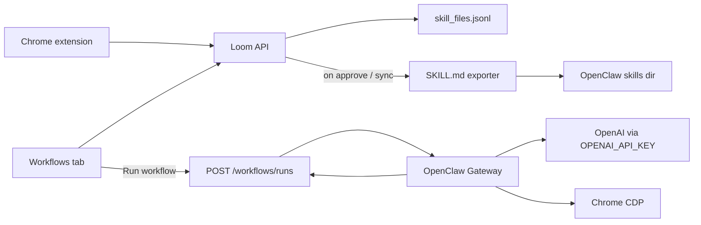

# Plan: OpenClaw × Loom Workflows

Today Loom Skill Files are **approved knowledge** (JSONL → Neo4j). They are not executable. OpenClaw is a **local agent gateway** with a first-class **browser tool** (CDP) and skills as `SKILL.md` folders. The integration is a bridge: **export approved workflows into OpenClaw skills, then run them with the browser tool using the existing `OPENAI_API_KEY`.**

## Goal

From Workflows: pick an approved skill → agent follows its steps in a real browser (click/type/navigate) → surface run status back in Loom.

## Recommended architecture

**OpenClaw owns browser execution.** Loom owns capture, approval, naming, and run orchestration/UI. Do not reimplement CDP inside FastAPI.

## Phase 0 — Local OpenClaw baseline (no Loom changes)

1. Install OpenClaw on the **host** (not inside the API container): needs Chrome/CDP access.
2. Auth with the same key Loom already uses:
   - Point OpenClaw at `OPENAI_API_KEY` from `apps/api/.env` (env export or OpenClaw API-key auth profile).
   - Set model to something like `openai/gpt-4o` / `openai/gpt-5.5` depending on account access — keep Loom’s `gpt-4o-mini` for capture/vision; use a stronger model for browser agent turns.
3. Enable browser:
   - **Attached** (preferred for company apps): control the user’s logged-in Chrome (SSO, cookies).
   - **Managed**: clean OpenClaw Chrome — better isolation, worse for “log into Salesforce as me.”
4. Smoke-test: `openclaw browser` + a one-step “open URL yep, and snapshot” task.

**Decision:** Attached vs managed. For extension-captured SaaS workflows, start with **attached**.

## Phase 1 — Skill format bridge (core product glue)

OpenClaw skills are directories with YAML frontmatter + markdown body ([AgentSkills / `SKILL.md`](https://docs.openclaw.ai/tools/skills)). Loom fields map cleanly:

| Loom `SkillFileDraft` | OpenClaw `SKILL.md` |
|---|---|
| `title` → slug `name` | frontmatter `name` |
| `purpose` | frontmatter `description` |
| `application`, `context`, `steps`, fields, warnings, decision_guidance | markdown body instructions |
| — | `metadata.openclaw.requires.config: ["browser.enabled"]` |

**Implementation sketch:**

- On **approve** (and on rename of approved skills), write/update:
  `~/.openclaw/skills/loom-<skill_id>/SKILL.md`
  or a Loom-owned dir mounted via `skills.load.extraDirs`.
- Only sync `status === "approved"` extension skills (same filter as Workflows).
- Reject/delete → remove or disable that skill dir.
- Keep Loom JSONL as source of truth; OpenClaw files are derived artifacts.

Optional: also keep Neo4j ingest as today so Ask can *describe* workflows while OpenClaw *runs* them.

## Phase 2 — Run API + Workflows UI

**API (new):**

- `POST /workflows/{skill_id}/runs` — create run, load skill text, call OpenClaw Gateway (webhook / agent session API).
- Prompt shape: “Execute this workflow. Use the browser tool. Follow steps; stop and ask on ambiguity or warnings.”
- `GET /workflows/runs/{id}` — status, step log, screenshots/errors.
- Persist runs under capture storage or Postgres (`queued | running | succeeded | failed | needs_input`).

**UI:** On each approved Workflows card: **Run**, status chip, link to last run log.

**Hard constraint:** Gateway must reach a browser on a machine with the right session. Typical local setup: OpenClaw Gateway on host + Loom API in Docker talking to `host.docker.internal:<gateway-port>`.

## Phase 3 — Safety & product polish

- Confirm-before-run for destructive steps (mirror Ask’s propose-then-send).
- Per-org allowlist of domains / applications from `skill.application`.
- Human-in-the-loop when skill has `warnings` or empty critical fields.
- Run transcript + screenshots stored like captures for audit.
- Don’t put `OPENAI_API_KEY` in the browser or extension; only Loom API ↔ OpenClaw host env.

## Env / config (minimal)

| Where | What |
|---|---|
| `apps/api/.env` (existing) | `OPENAI_API_KEY` — Loom capture/Ask unchanged |
| Host OpenClaw | Same key for agent turns; `browser.enabled`; skill `extraDirs` or sync path |
| New Loom settings | `OPENCLAW_GATEWAY_URL`, `OPENCLAW_TOKEN`, `OPENCLAW_SKILLS_DIR`, optional `OPENCLAW_BROWSER_PROFILE=user\|openclaw` |

Share the key via host env when starting both, or a small wrapper that sources `.env` — avoid duplicating secrets in git.

## What not to do (v1)

- Don’t embed OpenClaw inside the FastAPI process.
- Don’t expect attached Chrome to work from a Linux Docker container without a node host on the Mac.
- Don’t auto-run **proposed** skills — only approved.
- Don’t replace the extension; it remains the capture/teaching path.

## Delivery order

1. **Spike (½–1 day):** OpenClaw + OpenAI key + attached browser; hand-write one `SKILL.md` from an approved Loom skill; run it manually.
2. **Exporter:** approve → write `SKILL.md`; verify OpenClaw lists it.
3. **Run bridge:** Loom `POST …/runs` → Gateway turn → poll status.
4. **Workflows “Run” button** + run history.
5. Confirmations / domain guards.

## Current Loom context (relevant)

- Extension captures → `POST /captures` → session analyze → proposed Skill File in `skill_files.jsonl`.
- Workflows tab reviews extension skills; Expert Messages reviews `expert-request:*` skills.
- Approve → Neo4j ingest via `provider="skill_file"`. Skills are knowledge artifacts today; there is no browser automation runtime in Loom.
- OpenAI usage already centralized on `OPENAI_API_KEY` in `apps/api/.env` (`Settings.openai_api_key`).

## Open questions before build

1. **Browser session:** attached (your Chrome logins) vs managed (clean)?
2. **Trigger surface:** only Workflows UI, or also Ask (“run the expense workflow”)?
3. **Where OpenClaw lives:** always on your Mac for demos, or later a shared node host for the team?

## Suggested next step

Phase 0 spike plus a one-skill manual export so attached Chrome + the existing API key are proven before wiring the API.
